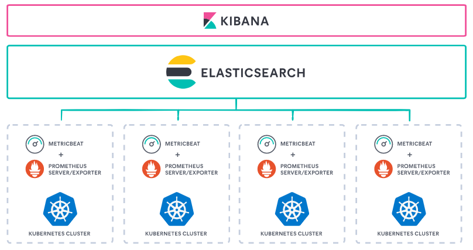
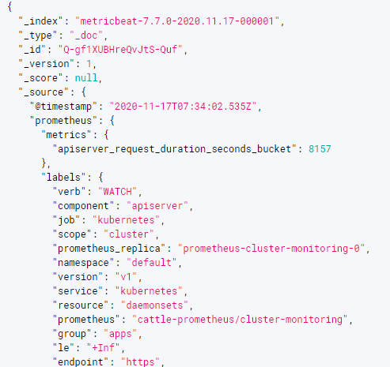
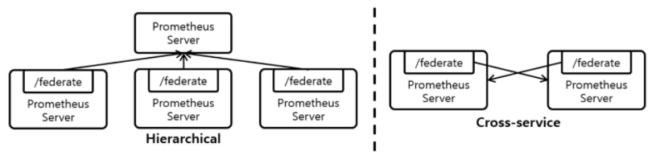

사내 K8S에서 운영하는 프로메테우스가 힘들어해서 스케일링이 필요해졌다. 메트릭 데이터를 외부에 저장해서 제공하기로 했다.

[Integrations](https://prometheus.io/docs/operating/integrations/)

[https://www.elastic.co/kr/blog/prometheus-monitoring-at-scale-with-the-elastic-stack](https://www.elastic.co/kr/blog/prometheus-monitoring-at-scale-with-the-elastic-stack)

### elasticsearch



metricbeat 를 활용해서 prometheus 의 metric data 를 elasticsearch 로 저장하는 방법을 먼저 해보았다.

metricbeat 는 사용하고 있는 kibana version 에 맞춰서 설치해야 한다. 무조건 최신버전으로 하면, 호환이 안된다.

인스톨 가이드

[https://www.elastic.co/guide/en/beats/metricbeat/7.10/metricbeat-installation-configuration.html](https://www.elastic.co/guide/en/beats/metricbeat/7.10/metricbeat-installation-configuration.html)

설정 가이드

[https://www.elastic.co/guide/en/beats/metricbeat/current/metricbeat-metricset-prometheus-remote_write.html](https://www.elastic.co/guide/en/beats/metricbeat/current/metricbeat-metricset-prometheus-remote_write.html)

결과



metric data 한 건당 document 가 하나씩 생긴다. 중복 데이터가 어마어마하게 쌓인다고 보면 된다. 조금 더 파고 들면 개선시킬 수도 있겠지만 여기서 일단 중단

### Federation

기존에 있는 사내 공용 프로메테우스와 그라파나를 활용한 방법을 시도해 봤다.

[Federation](https://prometheus.io/docs/prometheus/latest/federation/)

다수의 Prometheus Server 를 띄우고 Metric을 분산하여 수집하는 Horizontal Sharding 기반의 Scaling 기법

모든 Prometheus Server는 자신이 수집한 Metric을 외부에서 가져갈 수 있도록 /federate URL을 제공



설정

공용 프로메테우스에서 클라우드 프로메테우스를 pulling 하게 설정

- bearer_token : 클라우드 프로메테우스에 접근하기 위한 token 생성 및 추가
- job 하나로 했더니, scrape timeout 이 자주 발생했다. 그래서 match params 개수 만큼 job 나누고 scrape 설정도 적절하게 설정했다.

```text
scrape_configs:
  - job_name: 'federate01'
    scrape_interval: 1m
    scrape_interval: 15s
		bearer_token: token-sdfsdfhh:aslkdjflasjdlj
    honor_labels: true
    metrics_path: '/federate'

    params:
      'match[]':
        - '{job="expose-kubernetes-metrics"}'

    static_configs:
      - targets:
        - 'source-prometheus-1:9090'

- job_name: 'federate02'
    scrape_interval: 15s
    scrape_interval: 10s
		bearer_token: token-sdfsdfhh:aslkdjflasjdlj
    honor_labels: true
    metrics_path: '/federate'

    params:
      'match[]':
        - '{job="istio/istio-mesh"}'

    static_configs:
      - targets:
        - 'source-prometheus-1:9090'
```

## 결과

편하고 빠르다!
그라파나 대시보드도 export & import 해서 사내 공용 그라파나로 옮겼다.