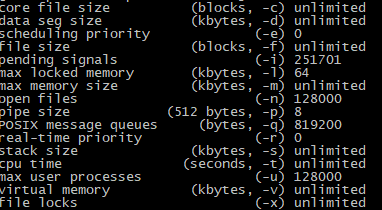
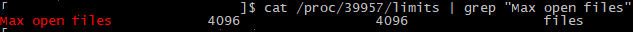
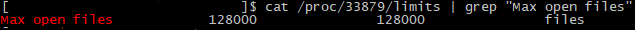

카프카 클러스터를 최초에 구축할 때, ‘recommend at least 128000 allowed for file descriptors ‘ 라는 가이드를 확인하고, /etc/security/limits.conf 에 적용을 했었다.



그런데 사용중에 아래와 같은 에러가 발생했다.

```
ERROR Error while accepting connection (kafka.network.Acceptor)

java.io.IOException: Too many open files

           at sun.nio.ch.ServerSocketChannelImpl.accept0(Native Method)

           at sun.nio.ch.ServerSocketChannelImpl.accept(ServerSocketChannelImpl.java:419)

           at sun.nio.ch.ServerSocketChannelImpl.accept(ServerSocketChannelImpl.java:247)

           at kafka.network.Acceptor.accept(SocketServer.scala:615)

           at kafka.network.Acceptor.run(SocketServer.scala:544)

           at java.lang.Thread.run(Thread.java:748)
```

그래서 장애발생시점의 Open File Descriptor 와 Network Sockstat 확인 해보니

두 값의 합 **(프로세스가 가질 수 있는 소켓 포함 파일 개수)** 가 4096에 가깝다는 것을 확인하고,

Java 기반의 카프카가 MaxFDLimit 에 의해 open files 값을 4096 으로 설정한 것으로 추정되서 확인해봤다.



**/etc/security/limits 설정이 반영되지 않은 이유**

카프카 클러스터는 systemd 를 사용해서 구동중인데, **systemd 가 /etc/security/limits 설정을 무시하는 것을 확인했다.

[https://serverfault.com/questions/628610/increasing-nproc-for-processes-launched-by-systemd-on-centos-7/678861#678861](https://serverfault.com/questions/628610/increasing-nproc-for-processes-launched-by-systemd-on-centos-7/678861#678861)

Systemd 설정에 LimitNOFILE=128000 을 추가해서 카프카 클러스터 재시작해서 해결했다.

