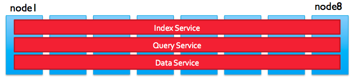
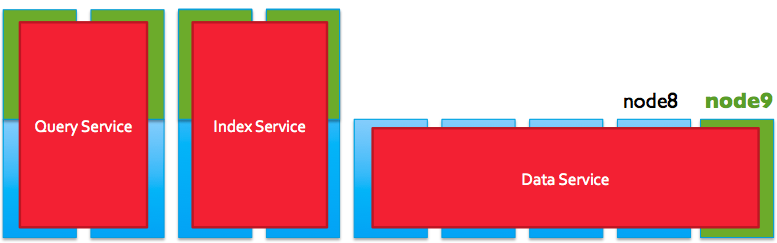

보통 NoSQL이라고 하면 분산형 구조에 수평 확장에 용이하다고 하는데, 카우치베이스 또한 그렇다. 덕분에 부하 분산도 잘 되고 노드 장애에 대한 대처나 노드 추가도 쉽다. 그리고 memcached를 자체적으로 사용하고 있어서 캐시급 성능을 낸다.

카우치베이스는 key를 통해 데이터를 저장/조회하는 JSON 기반의 Document Database 이자 key-value store이다. 카우치베이스의 Views, N1QL과 같은 기능을 사용하려면 JSON을 사용해야 한다. 각설하고 카우치베이스 클러스터에 부하가 늘어나면 스케일링을 해줘야 한다.

### 부하 원인
* 데이터 저장/조회 작업 (데이터 서비스)
* 인덱싱 작업(인덱스 서비스) - 인덱스는 쿼리 요청에 응답하는 동안에도 데이터 인덱싱을 빠르게 하고 있다.
* N1QL 쿼리 요청(쿼리 서비스) - 쿼리에 따라 인덱스를 사용하거나 key-value 조회를 한다.

이 밖에도 여러 원인이 있겠지만, 부하가 발생하면 수평 확장에 용이한 만큼 노드를 추가하면 된다.

수평 확장의 경우, 데이터 작업, 인덱싱 및 쿼리 작업이 동시에 동일한 서버에서 수행되기 때문에 서버 자원에 대해 경쟁이 일어난다. 예를 들면, 데이터가 저장/수정되는 만큼 인덱싱 작업도 수행해야 한다. 그리고 각 서비스에 알맞은 자원 배분이 힘들다. 데이터 서비스의 경우, 노드가 많으면 많을수록 얻는 이점이 크지만, 쿼리 서비스의 경우 노드가 많으면 각 노드에 쿼리 요청 및 결과 집계에 대기시간이 늘어나게 된다. 정리하면, 데이터 서비스는 스케일 아웃, 쿼리/인덱스 서비스는 스케일 업이 좋다. 이런 문제를 노드를 세 가지 타입으로 분리가 가능해 지는 카우치베이스 4.0 부터 해결할 수 있게 되었다.

### 노드 타입
* 데이터 서비스 - Couchbase Server에서 핵심인 데이터 작업 및 뷰를 수행하는 데이터 서비스. 어떤 클러스터 구성이든 데이터 서비스는 활성화 되어있어야 한다.
* 인덱스 서비스 - 인덱싱 작업을 수행하는 인덱스 서비스(Global Secondary Indexes). 인덱스 서비스는 클러스터 구성에 필수적이지 않다. key로만 작업한다면 필요가 없으니까.
* 쿼리 서비스 - N1QL 쿼리를 수행하는 쿼리 서비스. 마찬가지로 key로만 작업하면 필요없는 서비스다.

잘 보면 부하의 원인 세 가지와 매핑되게 서비스도 세 가지 타입으로 나누어 졌다. 이 말은 부하를 분리해서 대응할 수 있다는 것이다.

데이터 서비스 노드는 용량을 추가 하고 노드를 늘려서 대용량 데이터 처리에 대응할 수 있게 된다. 쿼리, 인덱스 서비스 노드는 노드 수를 줄이고 코어를 추가해 병렬 쿼리 연산을 향상시키고 메모리를 추가해 더 많은 인덱스를 캐시하게 할 수 있다.

### 마무리
공식 문서를 꼼꼼히 들여다 봐야겠다. 카우치베이스를 업그레이드할 때, MDS가 가능한지 모르고 지나칠 뻔했다.

#### Reference
* https://docs.couchbase.com/server/4.0/architecture/services-archi-multi-dimensional-scaling.html
* https://docs.couchbase.com/server/4.5/architecture/services-archi-multi-dimensional-scaling.html
* https://docs.couchbase.com/server/6.0/clustersetup/services-mds.html