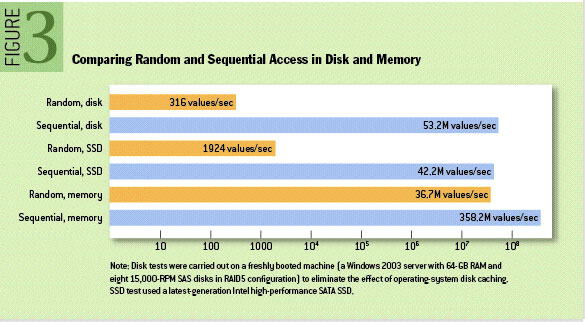
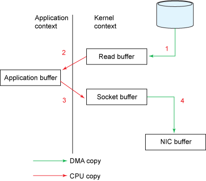
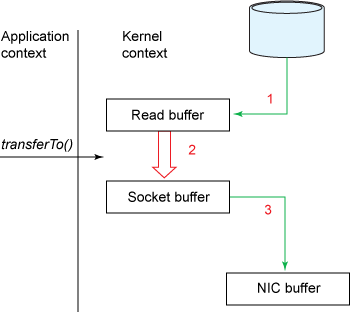

기존 메시징 시스템에서 파일 시스템은 성능 저하를 감수하면서도 메시지의 영속성을 위해서 어쩔 수 없이 사용했다. 그러나 카프카는 메시지를 메모리가 아닌 파일 시스템에 저장하면서도 보다 빠른 성능을 보여준다. 어떻게 이것이 가능한지 알아보자.

## Low latency in I/O = Filesystem?

RAM은 매우 낮은 대기 시간을 제공하므로 대부분의 기존 데이터 시스템은 데이터 저장소로 RAM (Random-Access Memory)을 사용한다. 하지만 이 방법을 사용하면 속도가 빠르지만 RAM 비용은 디스크보다 훨씬 비싸다. 이러한 시스템은 일반적으로 시스템을 통해 수백 개의 GBPS 데이터가 흐를 때 실행 비용이 많이 들게 된다.
Kafka는 파일 시스템을 사용하여 저장 및 캐싱을 수행한다. 여기서 문제는 디스크가 RAM보다 속도가 느리다는 것이다. 디스크를 통한 탐색 시간이 실제로 데이터를 읽는 데 필요한 시간보다 크기 때문이다.
카프카는 Sequential I/O 를 사용해서 탐색을 피하고 결과적으로 RAM만큼 낮은 대기 시간을 달성한다.

하드디스크의 순차적 읽기 성능은 메모리에 대한 랜덤 읽기 성능보다 뛰어나며 메모리의 순차적 읽기 성능보다 7배 정도 느리다.
MongoDB는 Btree를 사용하고 Cassandra는 LSM tree 자료 구조를 사용하는데 이런 데이터베이스 시스템은 랜덤 액세스를 할수 밖에 없고 O(log N) 탐색 성능을 보여 준다.
반면에 Kafka 는 Queue 자료구조를 사용해 Sequential I/O가 가능해서 O (1) 성능을 낼 수 있다.
여기에 더 해서 최신 운영 체제는 성능 저하가 거의없이 사용 가능한 모든 메모리를 디스크 캐싱으로 전환한다. 모든 디스크 읽기 및 쓰기는 페이지 캐시를 통하게 된다. 게다가 디스크 파일이 캐시에 올라올 때, 앞으로 필요할 것으로 예상되는 메시지까지 캐시에 올라와서(read-ahead) 페이지 폴트 발생도 줄인다.
이런 구조는 JVM 애플리케이션에서 캐시를 유지하는 것보다 훨씬 낫다. 힙 메모리 사용량이  증가할 수록  GC 가 점점 느려지고, 객체의 메모리 오버 헤드가 매우 커서 종종 저장된 데이터의 크기가 두 배가 되는 현상도 방지할 수 있다.
그리고 Kafka 프로세스가 직접 캐시를 관리하지 않고 OS에 위임하기 때문에 프로세스를 재시작 하더라도 OS의 페이지 캐시는 그대로 남아있어 프로세스 재시작 후 캐시를 워밍업할 필요가 없다는 장점도 있다.
그래서 파일 시스템을 사용하고 page cache 에 의존하는 구조가 메모리 내 캐시 또는 기타 구조를 유지하는 것보다 훨씬 성능이 좋다.

## Zero Copy

카프카는 파일 시스템에 저장된 메시지를 네트워크를 통해 consumer에게 전송할 때 zero copy 기법을 사용하여 데이터 전송 성능을 향상시킨다. 메시지는 카프카 브로커 프로세스내에 COPY 되지 않고 컨슈머에게 전송된다.
일반적으로 파일 시스템에 저장된 데이터를 네트워크로 전송할 땐 아래와 같이 커널모드와 유저모드 간의 데이터 복사가 발생하게 된다.

1. 유저가 read() 시스템 콜을 호출해 파일을 읽어달라고 요청하면, DMA 엔진에 의해서 디스크에 존재하는 파일의 내용이 커널 주소공간에 위치한 Read buffer에 복사된다.
2. 커널 주소공간에 위치한 Read buffer는 사용자가 접근할 수 없기 때문에 사용자가 read() 함수 호출시 파라미터로 전달한 Application buffer에 Read buffer의 내용을 복사해준다. 복사가 완료되면 함수 호출에서 리턴한다.
3. 사용자는 Application 버퍼로 읽어들인 데이터를 소켓으로 전송하기 위해 send() 함수를 호출한다. send() 함수 호출시 Application buffer를 파라미터로 전달하면 커널 영역에 위치한 Socket buffer로 데이터를 복사한다.
4. Socket buffer에 있는 데이터는 실제 네트워크로 전송하기 위해 네트워크 장비(NIC)에 있는 버퍼로 다시 복사된다.

read() 이후 send()를 수행하는 간단한 코드지만 코드를 수행하기 위해서 4번의 컨텍스트 스위칭과 4개의 메모리 복사본이 생기게 된다.
4개의 버퍼에 동일한 데이터가 복사되는 과정에서 애플리케이션의 CPU 자원이 소모된다. 이런 버퍼는 본래 메모리와 디스크, 메모리와 네트워크 장비 사이의 속도 차이를 만회하고자 만들어진 성능 개선 장치다. 읽기 측에서 중간 버퍼를 사용하면 응용 프로그램에서 커널 버퍼가 보유한만큼의 데이터를 요청하지 않은 경우 커널 버퍼가 "readahead cache"로 작동 할 수 있다. 즉 다음 데이터를 요청하면 물리적인 I/O 를 수행하지 않고 캐시에서 읽어서 사용자에게 전달 한다. 정리하면, 요청 된 데이터 양이 커널 버퍼 크기보다 작을 때 성능이 크게 향상된다.
앞서 설명했던 이런 버퍼링이 성능 저하를 유발하는 병목(bottleneck)으로 작용할 수 있다. 사용자가 요청하는 데이터의 크기가 커널이 유지하는 버퍼의 사이즈보다 큰 경우 미리 읽는(Read Ahead) 성능 개선 효과보다 여러 단계에 걸쳐 데이터를 복사하는 비효율이 더 커지게 된다.

시스템 콜을 수행하기 위해 유저모드와 커널모드를 오가는 컨텍스트 스위칭(Context Switching)이 발생하게 된다. 컨텍스트 스위칭은 수행 정보들을 백업하는 등의 오버헤드(Overhead)를 수반한다. 파일에서 읽어 소켓으로 전송하는 동작은 read() 함수의 호출과 반환, 소켓으로 데이터를 전송하는 send() 함수의 호출과 반환 등 총 4번의 컨텍스트 스위칭을 발생시킨다.

### Zero Copy 동작

리눅스 2.2 버전에서 처음 소개된 sendfile() 시스템 콜이 제로카피(Zero-copy) 동작을 구현했다. 자바(Java)에서는 nio 패키지에 transferTo(), transferFrom() 메소드로 구현되어 read(), send() 두 번의 시스템 콜이 transferFrom() 한번의 호출로 가능해졌다.

1. 사용자가 transferTo() 메소드를 이용해 파일 전송을 요청한다. read()와 send() 함수가 하나로 합쳐진 형태의 시스템 콜이다. read() 시스템 콜과 마찬가지로 DMA 엔진이 디스크에서 파일을 읽어 커널 주소 공간에 위치한 Read buffer로 데이터를 복사한다.
2. 커널 모드에서 유저 모드로 컨텍스트 스위칭하지 않고 바로 Socket buffer로 데이터를 복사한다.
3. Socket buffer에 복사된 데이터를 DMA 엔진을 통해 NIC buffer로 복사되어 진다.
4. 데이터가 전송되고 transferTo() 메소드에서 리턴한다.

모든 동작이 transferTo() 메소드 내에서 발생한다. 즉 컨텍스트 스위칭이 4번에서 2번으로 줄어들었다. transferTo() 메소드 호출시 커널 모드로 한번, 종료시 유저모드로 한번 총 2번의 컨텍스트 스위칭이 발생한다.

또 동작들이 유저 주소공간에 있는 Application Buffer로 복사되어지지 않기 때문에 데이터의 복사본이 4군데에서 3군데로 줄어들었다. 따라서 데이터를 복사하는 동작도 한 번 줄어들었다. 컨텍스트 스위칭 회수와 복사본의 개수가 줄어든만큼 CPU 자원의 낭비가 줄어들게되어 성능이 향상된다.

## 그 밖에 기술

Kafka는 위에서 언급 한 기술 외에 다른 많은 기술을 사용하여 시스템을 훨씬 빠르고 효율적으로 만들었다.

### Avoid too many small I/O operations

작고 빈번한 I/O 문제는 클라이언트와 브로커간에 그리고 브로커 자체의 메시지 저장 작업에서 발생한다. 이를 방지하기 위해 프로토콜은 메시지를 자연스럽게 그룹화하는 "메시지 세트" 추상화를 사용한다.
이를 통해 네트워크 요청은 메시지를 그룹화해서 요청하게 되어 한 번에 단일 메시지를 보내는 것보다 네트워크 왕복의 오버 헤드를 상쇄 할 수 있다.
브로커는 차례로 한 번에 로그에 메시지 청크를 추가하고 소비자는 한 번에 큰 선형 청크를 가져옵니다. 이 간단한 최적화는 속도를 크게 향상시킨다.
배치는 더 큰 네트워크 패킷, 더 큰 순차 디스크 작업, 연속 메모리 블록 등으로 이어지며, 이로 인해 Kafka는 데이터가 갑자기 집중적으로 한번씩 소규모로 발생하는 임의의 메시지 쓰기 스트림을 컨슈머에게 순차적 쓰기로 바꿀 수 있게 된다.

### End-to-end Batch Compression

병목 현상은 실제로 CPU 또는 디스크가 아니라 네트워크 대역폭에서 발생한다. 이는 광역 네트워크를 통해 데이터 센터간에 메시지를 보내야하는 데이터 파이프 라인의 경우 특히 그렇다.
물론 사용자는 Kafka에서 필요한 지원없이 항상 한 번에 하나씩 메시지를 압축 할 수 있지만, 동일한 유형의 메시지는 (예 : 필드 이름의 중복)로 인해 중복성이 많이 발생하므로 압축률이 매우 낮아질 수 있다.
효율적인 압축을 위해서는 각 메시지를 개별적으로 압축하는 대신 여러 메시지를 함께 압축해야한다. Kafka는 재귀 메시지 세트를 사용해서 이를 지원한다. 일괄 처리 된 메시지는 압축되어 서버로 전송 된다. 이 메시지 배치는 ​​압축 된 형태로 작성되어 로그에 압축 된 상태로 저장되며 컨슈머만 압축을 해제한다. Kafka는 GZIP, Snappy 및 LZ4 압축 프로토콜을 지원한다.

## 마무리

이 밖에 더 많은 내용은 [공식문서](https://kafka.apache.org/0102/documentation.html#design) 에 나와 있다. 주목할 점은 위의 모든 기술이 카프카 자체에 적용되어 있거나 운영체제에서 제공하는 기능을 사용해 지연 시간을 줄였다는 것이다. 커널을 다루거나 GC 를 조정하고 응용 프로그램을 수정 또는 극단적인 데이터 구조를 사용하지 않아도 된다.

## Reference
* https://www.freecodecamp.org/news/what-makes-apache-kafka-so-fast-a8d4f94ab145/
* https://developer.ibm.com/articles/j-zerocopy/
* https://kafka.apache.org/0102/documentation.html#design